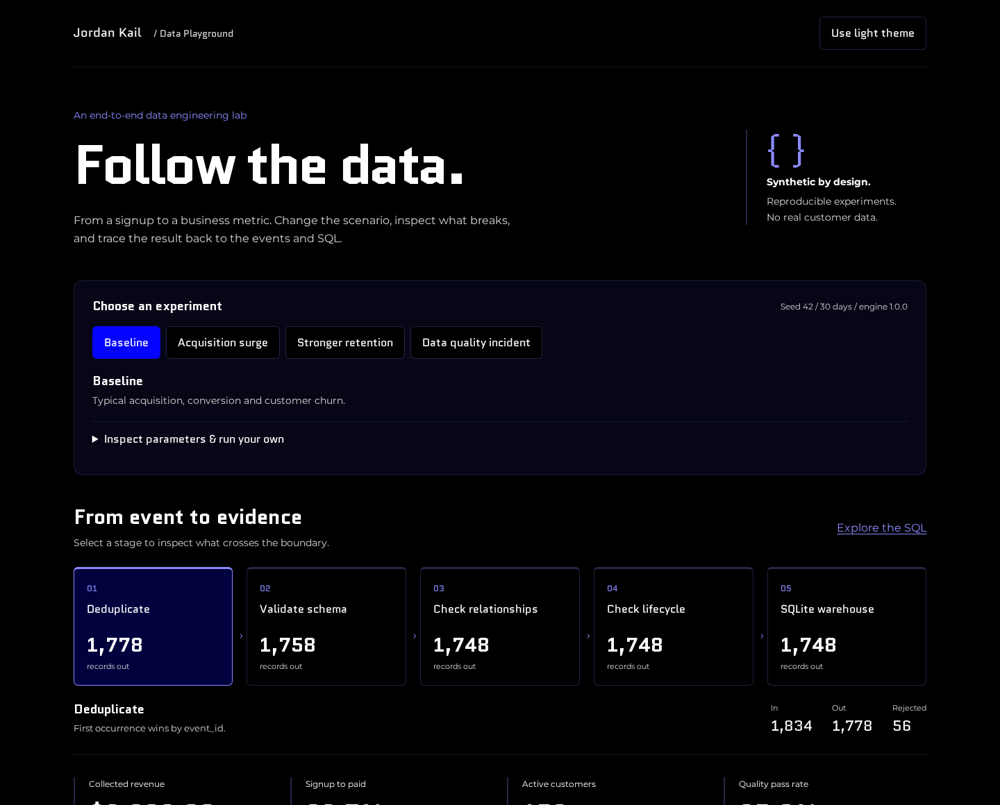
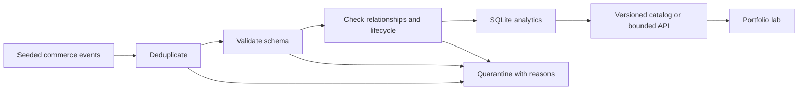

# Synthetic Data Playground

A reproducible commerce pipeline that turns synthetic signup, shop activation,
payment, and churn events into inspectable SQL metrics. Python owns generation,
validation, quarantine, analytics, and export. The portfolio consumes versioned
catalog artifacts and can optionally call the standalone service for custom runs.
No database, credentials, or production data are required for this supported lab.

## Portfolio experience

The React frontend is designed for [`jckail.com/dataplayground`](https://jckail.com/dataplayground)
and integrates with the [portfolio repository](https://github.com/jckail/portfolio).
Compare scenarios, inspect every validation boundary, filter event samples, and
read the SQL behind conversion, collected revenue, and customer retention.





## Run locally

Use Python 3.12 with venv support:

```bash
python3.12 -m venv .venv
.venv/bin/python -m pip install -r requirements-lab-dev.txt
.venv/bin/python -m playground export --output artifacts/catalog.json
.venv/bin/python -m playground simulate --seed 42 --days 30 --daily-signups 30
.venv/bin/uvicorn playground.api:app --host 127.0.0.1 --port 8010 --workers 1
```

The export contains baseline, acquisition, retention, and data-quality scenarios.
Open `http://127.0.0.1:8010/docs` for the API schema. Custom simulation example:

```bash
curl --fail-with-body http://127.0.0.1:8010/api/simulate \
  -H 'Content-Type: application/json' \
  -d '{"seed":42,"days":30,"daily_signups":30,"churn_rate":0.01}'
```

Alternatively, `docker compose -f compose.lab.yml up --build` starts only this lab
on loopback port 8010, without any PostgreSQL dependency. The container runs as a
non-root user with a read-only filesystem and CPU/memory limits.

## Inspect and reproduce

Each result includes aggregate metrics, daily series, conversion funnel, censored
cohort retention, pipeline counts, quality checks, bounded event/quarantine
samples, and SQL lineage. Money is integer cents. Revenue represents collected
synthetic subscription payments, not MRR. Displayed churn is cumulative churned
customers divided by ever-paying customers; the configuration rate is a daily
hazard. Unobserved cohort ages are `null`, not zero retention.

For the same complete configuration and engine version, the fixed start date
(2025-01-01), seeded RNG, event IDs, results, and canonical exports are repeatable.
Engine changes may change results; preserve `engine_version`, configuration, and
catalog source metadata when publishing artifacts. All records are synthetic.

See [architecture and API guide](docs/playground-architecture.md) for limits,
processing boundaries, deployment integration, and validation details.

## Test the supported lab

```bash
.venv/bin/python -m unittest discover -s tests -v
.venv/bin/ruff check playground tests
```

CI runs these checks and compares two catalog exports byte for byte. Tests cover
repeatability, data-quality isolation, SQL reconciliation, cohort censoring,
configuration bounds, API validation, streamed body limits, and worker capacity.
Tests target `tests/` explicitly: root-level legacy `test_connection.py` and
`test_supabase_permissions.py` connect to external databases and are not lab tests.

## Legacy implementation

`app.main`, `streamlit_app/`, the original `requirements.txt`, migrations, and the
original Docker Compose files remain the earlier PostgreSQL/Streamlit experiment.
They use a separate dependency set and database lifecycle. The new supported
entrypoint is **`playground.api:app`**. This work does not establish that the legacy
stack, its schema, or its asynchronous database operations are functional. Use
`requirements-lab.txt` and `compose.lab.yml` for the synthetic playground.
