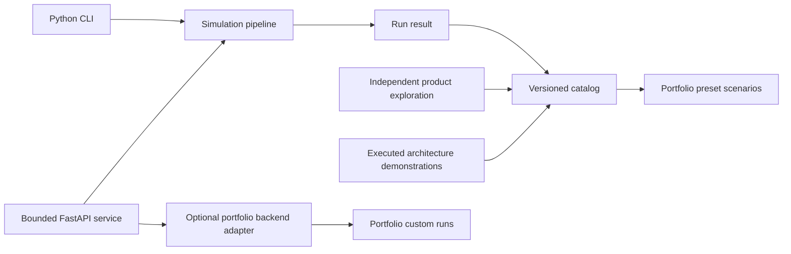
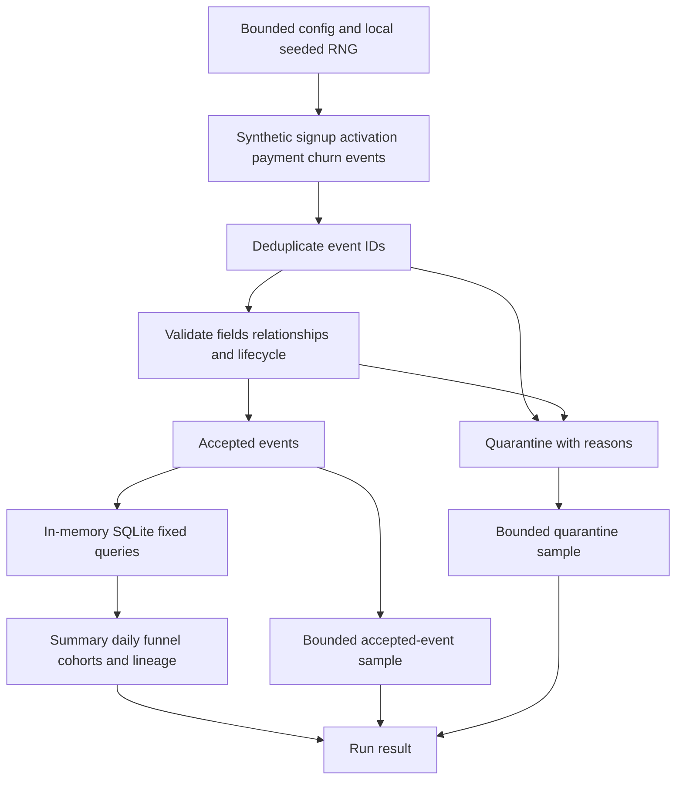

# Data Playground architecture

The supported lab is an independent Python package under [`playground/`](../playground).
It produces synthetic commerce results and a versioned catalog consumed by the
[portfolio UI](https://jckail.com/dataplayground). It opens no external database and
imports no legacy application settings.

## Execution and ownership



| Responsibility | Source |
| --- | --- |
| Input bounds and defaults | [`config.py`](../playground/config.py) |
| Seeded event generation | [`simulation.py`](../playground/simulation.py) |
| Validation, quarantine and result assembly | [`pipeline.py`](../playground/pipeline.py) |
| SQLite aggregation and SQL lineage | [`analytics.py`](../playground/analytics.py) |
| Presets and atomic JSON export | [`catalog.py`](../playground/catalog.py) |
| Graph and feature-vector artifacts | [`exploration.py`](../playground/exploration.py) |
| Executable local task DAG | [`architecture.py`](../playground/architecture.py) |
| HTTP validation and capacity | [`api.py`](../playground/api.py) |
| CLI commands | [`__main__.py`](../playground/__main__.py) |

The React application and optional upstream adapter belong to the separate
[portfolio repository](https://github.com/jckail/portfolio). There is no authored
standalone frontend for the supported API. Swagger and ReDoc are generated
framework documentation at `/docs` and `/redoc`.

## The processing boundary



Only accepted events reach analytics. Python validates lifecycle and payment
contracts before loading SQLite. The API accepts configuration, never arbitrary
SQL, file destinations or job definitions. Responses contain at most 100 accepted
examples and 50 quarantined examples; the samples are not complete input datasets.

[`run_simulation`](../playground/pipeline.py) returns `id`, `scenario`, `config`,
`summary`, `daily`, `funnel`, `cohorts`, `pipeline`, `quality`, `events`,
`quarantined` and `lineage`. The catalog wraps runs with `schema_version`,
`engine_version` and `source`, plus independent `exploration` and `architecture`
artifacts. Preserve that wrapper when moving a catalog between repositories.

## Reproducibility and metric meaning

Generation uses a fixed start date of 2025-01-01, a local seeded RNG and
deterministic IDs. Result identity includes configuration, scenario and both
version fields. A reproducible comparison keeps all of those inputs constant;
a changed engine can change the output for the same seed.

Money is integer cents. Revenue is collected synthetic subscription payments,
not MRR. Reported churn is cumulative churned customers divided by ever-paying
customers; configured `churn_rate` is a daily hazard. Cohort ages outside the
observation window are `null`, not zero retention.

The four presets are baseline, acquisition surge, stronger retention and data
quality incident. The graph/vector dataset is separate: 48 invented products,
32 synthetic customers and 160 purchase rows. Its vectors are eight handcrafted,
normalized features, not learned embeddings or a remote vector index. See the
[exploration guide](exploration.md) for encodings and similarity semantics.

## Local orchestration and production proposals

Replay real callbacks without an API, database or external scheduler:

```bash
.venv/bin/python -m playground orchestrate --failure none
.venv/bin/python -m playground orchestrate --failure analytics-transient
.venv/bin/python -m playground orchestrate --failure validation-permanent
```

The transient demonstration retries analytics; permanent validation failure blocks
its dependent tasks while the independent exploration branch can still execute.
Record quarantine and task failure are different outcomes. The scheduler performs
no network or cloud writes; `--output` explicitly asks the CLI to write JSON.

Model grains, constraints, callback traces and engineering decisions are explained
in [the architecture workbench](architecture-workbench.md). Proposed durable
storage, publication pointers and distributed replay controls are design records,
not implemented production infrastructure or exactly-once guarantees.

## Retained legacy experiment

`app.main` and `streamlit_app/` use PostgreSQL and separate dependencies. They are
not part of the supported engine or its Docker image. The legacy home now handles
missing report files and queued-job feedback, but those repairs do not establish
that its database, schema or scheduler operations work. The design canvas contains
those legacy page imports; the supported React experience remains in Portfolio.

The rest of the retained experiment sits at the repository root and is likewise
outside the supported lab:

| Path | Role in the legacy experiment |
| --- | --- |
| `docker-compose.yml`, `docker-compose-local.yml` | Original stacks: Nginx, FastAPI, Streamlit and Prometheus, plus PostgreSQL in the local file |
| `Dockerfile.fastapi`, `Dockerfile.streamlit`, `Dockerfile.disk_monitor` | Images for those services |
| `alembic/`, `alembic.ini`, `rinit.sql` | Migrations, the partitioned [data model notes](../alembic/DataModel.md) and initial SQL |
| `nginx/`, `prometheus/`, `grafana/` | Reverse proxy, metrics scrape and dashboard configuration |
| `helpers/`, `wait_for_db.py`, `disk_monitor.py` | Migration/startup helper scripts and a disk-usage metrics exporter |
| `run_query.py`, `test_connection.py`, `test_supabase_permissions.py` | Root-level database scripts that connect to an external database; not part of `tests/` |
| `fake_data_reports/` | Generated report output from 2024 runs of the old data generator |

Continue with [API contracts and operations](service-operations.mdx), or return to
[the quickstart](../README.md).
