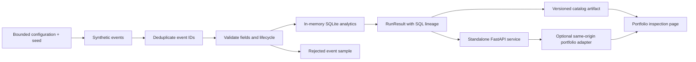

# Playground architecture and API

The standalone lab is intentionally independent of the legacy `app` package.
It imports no production settings and opens no remote database connections.

Generation uses a local RNG, deterministic IDs, and a fixed 2025-01-01 start date.
Injected duplicate and malformed records exercise deduplication and validation.
Only accepted events feed SQL analytics. Full accepted events remain internal;
responses expose at most 100 accepted and 50 quarantined examples. Stage counts,
funnel counts, daily revenue, and customer balances can be reconciled. In-memory
SQLite executes fixed internal queries; neither API accepts SQL or destinations.

## HTTP contract

| Method | Path | Result |
| --- | --- | --- |
| GET | `/health` | Service status, schema/engine version, synthetic label |
| GET | `/api/catalog` | Schema version 1 catalog with four scenario runs |
| POST | `/api/simulate` | One RunResult for the submitted configuration |

POST accepts a JSON object; omitted fields use these defaults:

| Field | Default | Allowed values |
| --- | --- | --- |
| seed | 42 | integer 0–2147483647 |
| days | 30 | integer 7–90 |
| daily_signups | 30 | integer 5–100 |
| activation_rate | 0.65 | finite number 0–1 |
| payment_rate | 0.35 | finite number 0–1 |
| churn_rate | 0.02 | finite number 0–0.2 |
| duplicate_rate | 0.03 | finite number 0–0.2 |
| invalid_rate | 0.02 | finite number 0–0.2 |

Unknown fields, booleans used as numbers, numeric strings, non-finite rates, and
out-of-range values return 422. Requests exceeding 4096 actual body bytes return
413, including streamed requests without a Content-Length header. At most two
catalog/simulation workers execute per process; exhausted capacity returns 429
with Retry-After. The worker owns its slot and releases it in `finally`, so a
cancelled client cannot free capacity while its computation still runs. CPU work
runs in FastAPI's threadpool, keeping health requests off the computation path.
The finite day/signup bounds limit computation cost; there is no arbitrary job,
SQL, file path, or external destination argument. The catalog is cached in memory.

Run a single worker to retain the documented per-service concurrency bound.
A client disconnect does not forcibly kill Python threads. The container adds
512 MB memory and one CPU limits. For public hosting, configure the hosting
platform's ingress timeout, connection limits, and traffic controls as appropriate;
the application does not implement user authentication or per-user quotas.

## Portfolio integration and deployment

The default portfolio experience reads a committed catalog generated by
`python -m playground export --output artifacts/catalog.json`. Copy the generated
artifact into the portfolio's catalog location while preserving source metadata.
No running Python service is needed to explore those preset scenarios.

The optional adapter calls this service at a fixed server-side base URL. Configure
`DATAPLAYGROUND_API_URL` in the portfolio backend (for example
`http://127.0.0.1:8010` when both processes run locally). In separate containers,
use the service's internal DNS name, not loopback. The browser uses portfolio
same-origin routes; no upstream URL or credential belongs in frontend code.
The portfolio GET `/api/dataplayground` adds a `live_simulation` flag, and its POST
`/api/dataplayground/simulate` validates requests and responses and enforces an
upstream timeout. Without a service URL, custom runs return 503. Failed custom
runs must be shown as failures, without silently substituting a preset.

The lab CI workflow is validation only. Production delivery belongs to the target
platform's existing CI and secret configuration; no local deploy command is
required. Do not set legacy PostgreSQL credentials for this service.

## Test boundaries

Engine unit tests check deterministic generation, strict bounds, corruption
isolation, aggregate reconciliation, cohort censoring, and export parity. API tests
use FastAPI's local client and controlled worker primitives, including actual ASGI
chunk counting and a cancelled waiter retaining its active worker slot. They never
import legacy DB entrypoints. Portfolio validation and browser interaction tests
live in the portfolio repository. Lint is scoped to new `playground/` and `tests/`
code rather than making claims about the legacy experiment.
